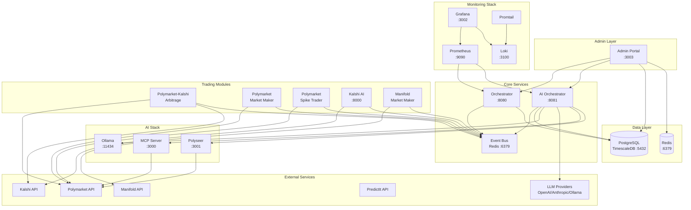

# PredictBot Stack

<div align="center">


**A cross-platform prediction market trading bot stack that operates on Polymarket, Kalshi, Manifold Markets, and PredictIt.**

[Quick Start](#-quick-start) • [Features](#-features) • [Architecture](#-architecture) • [Documentation](#-documentation)

</div>

---

## 📋 Overview

PredictBot Stack is a comprehensive, production-ready trading system that combines multiple trading strategies (arbitrage, market making, spike trading, and AI-driven trading) across prediction market platforms. It leverages battle-tested open-source components and integrates them through a unified architecture with:

- **8 Trading Modules** - Specialized bots for different strategies and platforms
- **AI Stack** - LangGraph-based multi-agent system with 6 specialized agents
- **Admin Portal** - Next.js dashboard for monitoring and control
- **Full Observability** - Prometheus, Grafana, and Loki for metrics and logs
- **Event-Driven Architecture** - Redis-based event bus for real-time coordination

## ✨ Features

### Trading Capabilities
- **Multi-Platform Support**: Trade simultaneously on Polymarket, Kalshi, Manifold, and PredictIt
- **Multi-Strategy Synergy**: Four complementary trading strategies operating in parallel
- **AI-Driven Analysis**: LLM-powered market analysis with multi-agent decision framework
- **Risk Management**: Comprehensive circuit breakers, position limits, and capital allocation

### Infrastructure
- **Docker Deployment**: Fully containerized for easy VPS deployment
- **Profile-Based Startup**: Run full stack or individual components
- **Automatic Health Checks**: All services monitored with auto-restart
- **Centralized Logging**: All logs aggregated in Loki, viewable in Grafana

### Admin Portal
- **Real-time Dashboard**: Live P&L, positions, and system status
- **Strategy Control**: Enable/disable strategies, adjust parameters
- **AI Insights**: View AI agent decisions and reasoning
- **Alert Management**: Configure and manage notifications

## 🏗️ Architecture



### Service Ports

| Service | Port | Description |
|---------|------|-------------|
| **Admin Portal** | 3003 | Next.js dashboard |
| **Orchestrator** | 8080 | Central coordination API |
| **AI Orchestrator** | 8081 | LangGraph multi-agent API |
| **Kalshi AI Dashboard** | 8000 | Kalshi AI trading dashboard |
| **MCP Server** | 3000 | Model Context Protocol server |
| **Polyseer** | 3001 | Research assistant |
| **Grafana** | 3002 | Metrics dashboards |
| **Prometheus** | 9090 | Metrics collection |
| **Loki** | 3100 | Log aggregation |
| **PostgreSQL** | 5432 | TimescaleDB database |
| **Redis** | 6379 | Cache and event bus |
| **Ollama** | 11434 | Local LLM server |

### Trading Strategies

| Strategy | Description | Platforms | Module |
|----------|-------------|-----------|--------|
| **Arbitrage** | Cross-market price discrepancy exploitation | Polymarket, Kalshi | `polymarket-arb` |
| **Market Making** | Liquidity provision with spread capture | Polymarket | `polymarket-mm` |
| **Market Making** | Liquidity provision with spread capture | Manifold | `manifold-mm` |
| **Spike Trading** | Momentum/mean-reversion on price spikes | Polymarket | `polymarket-spike` |
| **AI Trading** | LLM-powered directional trading | Kalshi | `kalshi-ai` |
| **AI Multi-Agent** | 6-agent LangGraph system | All platforms | `ai_orchestrator` |

### AI Agents

The AI Orchestrator includes 6 specialized agents:

1. **Market Scanner Agent** - Discovers and filters trading opportunities
2. **Research Agent** - Deep dives into market fundamentals
3. **Sentiment Agent** - Analyzes news and social sentiment
4. **Risk Agent** - Evaluates position risk and portfolio impact
5. **Execution Agent** - Determines optimal trade execution
6. **Supervisor Agent** - Coordinates all agents and makes final decisions

## 🚀 Quick Start

### Prerequisites

- Docker and Docker Compose v2.0+
- Git
- 4GB+ RAM (8GB+ recommended for AI features)
- API keys for target platforms
- (Optional) NVIDIA GPU for local LLM with Ollama

### Installation

```bash
# 1. Clone the repository
git clone https://github.com/yourusername/predictbot-stack.git
cd predictbot-stack

# 2. Initialize submodules
git submodule update --init --recursive

# 3. Run setup script
chmod +x scripts/setup.sh
./scripts/setup.sh

# 4. Configure environment
cp .env.template .env
# Edit .env with your API keys and settings

# 5. Validate configuration
python scripts/validate_config.py
python scripts/validate_secrets.py

# 6. Start in dry-run mode (recommended for first run)
./scripts/start.sh --profile full --dry-run

# 7. Access the Admin Portal
# Open http://localhost:3003 in your browser
```

### Quick Commands

```bash
# Start all services
./scripts/start.sh --profile full

# Start minimal (trading only, no monitoring)
./scripts/start.sh --profile minimal

# Stop all services
./scripts/stop.sh

# View logs
docker-compose logs -f

# Check health
./scripts/health-check.sh

# Backup data
./scripts/backup.sh
```

## 📁 Project Structure

```
predictbot-stack/
├── config/                     # Configuration files
│   ├── config.example.yml      # Strategy parameters template
│   ├── markets.yml             # Market mappings
│   ├── prometheus.yml          # Prometheus configuration
│   ├── promtail-config.yml     # Log collection config
│   └── grafana/                # Grafana dashboards
├── modules/                    # Trading modules (git submodules)
│   ├── polymarket_arb/         # Rust arbitrage bot
│   ├── polymarket_mm/          # Python market maker
│   ├── polymarket_spike/       # Python spike trader
│   ├── kalshi_ai/              # Python AI trading bot
│   ├── manifold_mm/            # Node.js market maker
│   ├── mcp_server/             # Rust MCP server
│   ├── polyseer/               # TypeScript research assistant
│   ├── ai_orchestrator/        # LangGraph multi-agent system
│   └── admin_portal/           # Next.js admin dashboard
├── orchestrator/               # Central coordination
│   ├── main.py                 # Entry point
│   ├── risk_manager.py         # Risk management logic
│   ├── position_tracker.py     # Position aggregation
│   ├── capital_allocator.py    # Capital distribution
│   ├── event_bus.py            # Redis event bus
│   └── alert_manager.py        # Notification system
├── database/                   # Database schemas
│   └── init.sql                # PostgreSQL initialization
├── shared/                     # Shared Python utilities
│   ├── event_schemas.py        # Event type definitions
│   └── logging_config.py       # Centralized logging
├── scripts/                    # Utility scripts
│   ├── setup.sh                # Initial setup
│   ├── start.sh                # Start services
│   ├── stop.sh                 # Stop services
│   ├── backup.sh               # Backup data
│   ├── health-check.sh         # Health verification
│   ├── validate_config.py      # Config validator
│   └── validate_secrets.py     # Secrets validator
├── docs/                       # Documentation
│   ├── quickstart.md           # Quick start guide
│   ├── deployment.md           # Production deployment
│   ├── configuration.md        # Configuration reference
│   ├── testing.md              # Testing guide
│   ├── troubleshooting.md      # Troubleshooting guide
│   ├── api-reference.md        # API documentation
│   ├── api-setup.md            # API key instructions
│   └── security.md             # Security best practices
├── docker-compose.yml          # Container orchestration
├── .env.template               # Environment template
├── .gitignore                  # Git ignore rules
└── .gitmodules                 # Submodule definitions
```

## ⚙️ Configuration

### Environment Variables

Key environment variables (see [`.env.template`](.env.template) for complete list):

```bash
# Trading Mode
DRY_RUN=1                       # 1=paper trading, 0=live trading

# Platform API Keys
POLY_PRIVATE_KEY=               # Polymarket wallet private key
KALSHI_API_KEY=                 # Kalshi API key
KALSHI_API_SECRET=              # Kalshi API secret
MANIFOLD_API_KEY=               # Manifold API key

# AI Configuration
OPENAI_API_KEY=                 # OpenAI API key
ANTHROPIC_API_KEY=              # Anthropic API key
AI_CONFIDENCE_THRESHOLD=0.6     # Minimum confidence to trade

# Risk Management
MAX_DAILY_LOSS=100              # Stop trading if exceeded
MAX_TOTAL_POSITION=1000         # Maximum total exposure

# Notifications
SLACK_WEBHOOK_URL=              # Slack alerts
DISCORD_WEBHOOK_URL=            # Discord alerts
```

### Strategy Parameters

See [`config/config.example.yml`](config/config.example.yml) for detailed strategy configuration.

## 🛡️ Risk Controls

| Control | Description | Default |
|---------|-------------|---------|
| `DRY_RUN` | Paper trading mode | Enabled |
| `MAX_DAILY_LOSS` | Stop trading if daily loss exceeds | $100 |
| `MAX_TOTAL_POSITION` | Maximum total exposure | $1000 |
| `ARB_MIN_PROFIT` | Minimum arbitrage profit threshold | 2% |
| `AI_CONFIDENCE_THRESHOLD` | Minimum AI confidence to trade | 60% |
| `CIRCUIT_BREAKER_THRESHOLD` | Failures before auto-halt | 5 |
| `CIRCUIT_BREAKER_COOLDOWN` | Cooldown period after halt | 300s |

## 📊 Monitoring

### Grafana Dashboards

Access Grafana at `http://localhost:3002` (default: admin/admin)

Pre-configured dashboards:
- **System Overview** - All services health and metrics
- **Trading Performance** - P&L, win rate, trade volume
- **AI Insights** - Agent decisions, confidence scores
- **Risk Dashboard** - Position exposure, circuit breaker status

### Alerts

Configure alerts via:
- **Slack** - Set `SLACK_WEBHOOK_URL`
- **Discord** - Set `DISCORD_WEBHOOK_URL`
- **Email** - Configure SMTP settings

Alert types:
- Trade executed
- Circuit breaker triggered
- Daily loss limit reached
- Service health issues
- AI confidence warnings

## 📚 Documentation

| Document | Description |
|----------|-------------|
| [Quick Start Guide](docs/quickstart.md) | Step-by-step setup instructions |
| [Deployment Guide](docs/deployment.md) | Production deployment on VPS |
| [Configuration Reference](docs/configuration.md) | Complete configuration options |
| [Testing Guide](docs/testing.md) | Testing and validation |
| [Troubleshooting](docs/troubleshooting.md) | Common issues and solutions |
| [API Reference](docs/api-reference.md) | REST API documentation |
| [API Setup](docs/api-setup.md) | Platform API key instructions |
| [Security Guide](docs/security.md) | Security best practices |

## 🔧 Open Source Components

This project integrates the following open-source repositories:

| Component | Repository | Language |
|-----------|------------|----------|
| Arbitrage Bot | [Polymarket-Kalshi-Arbitrage-bot](https://github.com/terauss/Polymarket-Kalshi-Arbitrage-bot) | Rust |
| Polymarket MM | [polymarket-market-maker-bot](https://github.com/lorine93s/polymarket-market-maker-bot) | Python |
| Manifold MM | [market-maker](https://github.com/manifoldmarkets/market-maker) | TypeScript |
| Spike Bot | [Polymarket-spike-bot-v1](https://github.com/Trust412/Polymarket-spike-bot-v1) | Python |
| Kalshi AI | [kalshi-ai-trading-bot](https://github.com/ryanfrigo/kalshi-ai-trading-bot) | Python |
| Polyseer | [Polyseer](https://github.com/yorkeccak/Polyseer) | TypeScript |
| MCP Server | [polymarket-mcp-server](https://github.com/0x79de/polymarket-mcp-server) | Rust |

## ⚠️ Disclaimer

**USE AT YOUR OWN RISK.** This software is provided for educational purposes only. Trading prediction markets involves significant financial risk. 

- Always start with `DRY_RUN=1` (paper trading mode)
- Use small position sizes when going live
- Monitor the system closely during initial live trading
- The authors are not responsible for any financial losses

## 📄 License

MIT License - See [LICENSE](LICENSE) for details.

---

<div align="center">

**[⬆ Back to Top](#predictbot-stack)**

Made with ❤️ for the prediction market community

</div>
